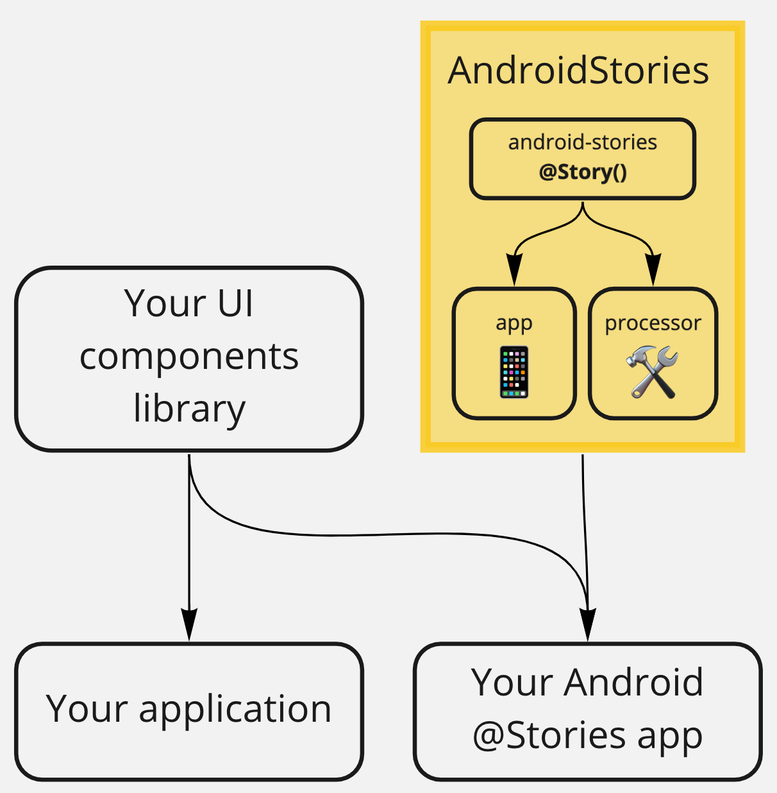

AndroidStories
========  

AndroidStories is a development environment for UI components on Android.
It allows you to browse a component library, and interactively develop and test components.
The usage of AndroidStories is based on the creation of a dedicated app-module where define stories.

[Here an example app](example-app)
<p align="center">
	
</p>

 - [Getting Started](#getting-started)
 	- [Gradle configuration](#gradle-configuration)
 	- [App class](#app-class)
 - [How to use](#how-to-use)
	- [Stories](#stories)
		- [LayoutStory](#layoutstory)
		- [Android Fragment](#android-fragment)
		- [StoryFragment](#storyfragment)
	- [Async stories](#async-stories)
		- [AsyncVariant with coroutine](#asyncvariant-with-coroutine)
		- [AsyncStoryFragment](#asyncstoryfragment)
		- [AsyncLayoutStory](#asynclayoutstory)
		- [UILoader](#uiloader)

## Getting Started

### Gradle configuration
To start writing stories we need first to add jitpack in your root build.gradle at the end of repositories:
```  
allprojects {
    repositories {
        ...
        maven { url 'https://jitpack.io' }
    }
}
```

add to the example app gradle file:
1) kapt plugin to generate the stories provider
```  
plugins {  
	 ...
	 id 'kotlin-kapt'
 }  
```
2) AndroidStories dependencies
```  
dependencies {  
	 ...
	implementation 'com.github.iGenius-Srl:android-stories:0.0.1'
    kapt 'com.github.iGenius-Srl:android-stories:0.0.1'
 }  
```  

### App Class
To run the stories we need to provide the generated stories to the application,  
to do that you need to make the project and create a custom Application class that extends the `StoriesApp` class in order to instantiate the generated provider.

```
class ExampleStoriesApp: StoriesApp() {  
    override val storiesProvider: StoriesProvider  
        get() = AppStoriesProvider()  // generated stories provider
}
```
declare the application class in the manifest
```
<application  
	... 
	android:name="path.to.ExampleStoriesApp"  
	...>
</application>
```
done!

# How to use
To declare a story we have to annotate with `@Story` several classes

## Stories

### LayoutStory
This is an example of the shortest story:
a LayoutStory variable that defines the title by the variable name
and the content by a layout resource
```
@Story val simple_story = LayoutStory(R.layout.simple_story)
```

Complete usage example of an [LayoutStory](androidstories-app/src/main/java/com/igenius/androidstories/app/story/LayoutStory.kt#L8):
The story defines a title with a path, a description and a list of variants (different version of the same story).
```
@Story(
    title = "Button/Base Button",
    description = "This is a story with different variants, press on the right to select ones",
    variants = ["Red", "Blue"]
)
val button_story = LayoutStory(R.layout.button_story) { variant ->
    when (variant) {
        "Red" -> android.R.color.holo_red_light
        else -> android.R.color.holo_blue_bright
    }.let(findViewById<View>(R.id.button)::setBackgroundColorRes)
}
```

### Android Fragment
A story can be even defined with a simple fragment class
```
@Story(
    title = "Fragment/Native Fragment",
    description = "Example of a Fragment story, variants cannot be used"
)
class NativeFragment: Fragment() {
    override fun onCreateView(
        inflater: LayoutInflater,
        container: ViewGroup?,
        savedInstanceState: Bundle?
    ): View = inflater.inflate(R.layout.simple_story, container, false)
}
```

### StoryFragment
[StoryFragment](androidstories-app/src/main/java/com/igenius/androidstories/app/story/StoryFragment.kt#L14) allows you to create custom fragments that are being updated at every story variant change throughout [StoryFragment.onVariantSelected](androidstories-app/src/main/java/com/igenius/androidstories/app/story/StoryFragment.kt#L53).
```
@Story(
    title = "Fragment/Story Fragment",
    description = "This is a fragment story with different variants, press on the right to select ones",
    variants = ["Red", "Blue"]
)
class ExampleFragment: StoryFragment() {
    override fun getLayoutRes() = R.layout.button_story

    override fun onVariantSelected(variant: String) {
        view?.findViewById<Button>(R.id.button)?.setBackgroundColorRes(
            when (variant) {
                "Red" -> android.R.color.holo_red_light
                else -> android.R.color.holo_blue_bright
            }
        )
    }
}
```

## Async stories

## AsyncVariant with coroutine
In some cases is useful to load big mock data to prepare our story such as parsing a big local json.
Android stories allows you to handle heavy operation thanks to [AsyncVariantProvider](androidstories/src/main/java/com/igenius/androidstories/annotations/Story.kt#L57).

Here an example about how to use it:
```
// Our data class
data class Test (val foo: String)

// AsyncVariantProvider implementation that provides data from a variant
class AsyncExampleFragmentProvider: AsyncVariantProvider<Test>() {
    override suspend fun provide(variant: String): Test {
        delay(3000)
        return Test(variant)
    }
}

// Async story declaration
@Story(
    title = "AsyncLayout/Simple story",
    variants = ["Red", "Blue"],
)
@AsyncVariant(AsyncExampleFragmentProvider::class)
val async_layout_story = AsyncLayoutStory<Test>(R.layout.button_story) { variant, data ->
    findViewById<Button>(R.id.button)?.setBackgroundColorRes(
        when (data.foo) {
            "Red" -> android.R.color.holo_red_light
            else -> android.R.color.holo_blue_bright
        }
    )
}
```

If the loading of data needs a context instance, AndroidStories has the dedicated provider class [AsyncContextVariantProvider](androidstories-app/src/main/java/com/igenius/androidstories/app/models/StoriesProvider.kt#L63),
that receives the current context instance as first parameter of [AsyncContextVariantProvider.provide](androidstories-app/src/main/java/com/igenius/androidstories/app/models/StoriesProvider.kt#L73).

The classes that supports async providers are:

### AsyncStoryFragment
[AsyncStoryFragment](androidstories-app/src/main/java/com/igenius/androidstories/app/story/StoryFragment.kt#L65) is similar to [StoryFragment](androidstories-app/src/main/java/com/igenius/androidstories/app/story/StoryFragment.kt#L14) but with a data parameter inside the [onVariantLoaded](androidstories-app/src/main/java/com/igenius/androidstories/app/story/StoryFragment.kt#L77) method

```
@Story(
    title = "Fragment/Async Fragment",
    variants = ["Red", "Blue"],
)
@AsyncVariant(AsyncExampleFragmentProvider::class)
class AsyncExampleFragment: AsyncStoryFragment<Test>() {

    override fun getLayoutRes() = R.layout.button_story

    override fun onVariantLoaded(variant: String, data: Test) {
        view?.findViewById<Button>(R.id.button)?.setBackgroundColorRes(
            when (data.foo) {
                "Red" -> android.R.color.holo_red_light
                else -> android.R.color.holo_blue_bright
            }
        )
    }
}
```

### AsyncLayoutStory
[AsyncLayoutStory](androidstories-app/src/main/java/com/igenius/androidstories/app/story/LayoutStory.kt#L28) is similar to [LayoutStory](androidstories-app/src/main/java/com/igenius/androidstories/app/story/LayoutStory.kt#L8) that receives a data parameter in [onVariantLoaded](androidstories-app/src/main/java/com/igenius/androidstories/app/story/LayoutStory.kt#L48) action

```
@Story(
    title = "AsyncLayout/Simple story",
    description = "This is a story with different variants, press on the right to select ones",
    variants = ["Red", "Blue"],
)
@AsyncVariant(AsyncExampleFragmentProvider::class)
val async_layout_story = AsyncLayoutStory<Test>(R.layout.button_story) { variant, data ->
    findViewById<Button>(R.id.button)?.setBackgroundColorRes(
        when (data.foo) {
            "Red" -> android.R.color.holo_red_light
            else -> android.R.color.holo_blue_bright
        }
    )
}
```

### UILoader
By default async stories are shown only when the variant's data is ready and provided to the story showing a default loader during the loading time.
In some cases is useful to prevent showing the loader but insted the view as it is (in case that our story have to handle also the loading status).
To do that you should override the property `preventUiLoader` in both [AsyncLayoutStory](androidstories-app/src/main/java/com/igenius/androidstories/app/story/LayoutStory.kt#L39) and [AsyncStoryFragment](androidstories-app/src/main/java/com/igenius/androidstories/app/story/StoryFragment.kt#L70)
